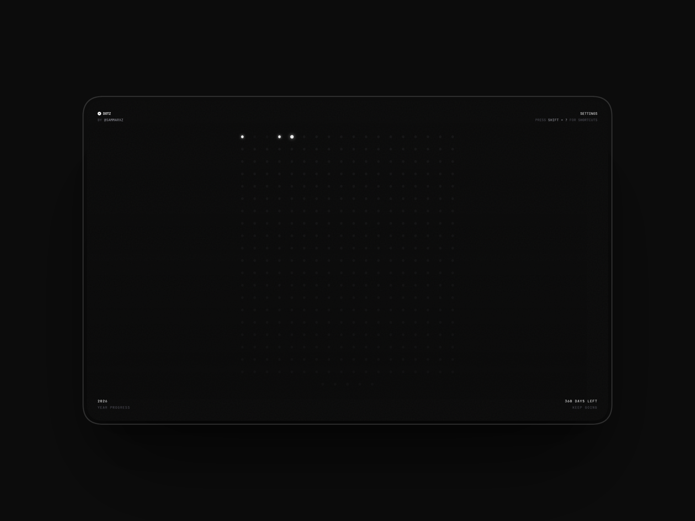

# dotz

Minimalist journaling for the focused mind. One dot, one day.



## Features

- **365 Days**: Visual grid representing each day of the year
- **File System Storage**: Entries saved directly to your local file system
- **Daily Reminders**: Get notified to write at your chosen time
- **Typewriter Sounds**: Optional sound effects
- **Markdown Support**: Write with markdown formatting
- **Auto-save**: Entries automatically saved as you type

## Getting Started

### Prerequisites

- Node.js 18+
- Modern browser with File System Access API support (Chrome, Edge, Opera)

### Installation

```bash
npm install
npm run dev
```

Open [http://localhost:3000](http://localhost:3000) in your browser.

## Usage

1. Choose a folder to store your journal entries (first time setup)
2. Click any dot to write an entry for that day
3. Dots light up when you've written an entry
4. Press `Cmd/Ctrl + ,` to open settings

## Keyboard Shortcuts

- `Cmd/Ctrl + N` - Open today's entry
- `Cmd/Ctrl + ,` - Open settings
- `Shift + ?` - Show shortcuts
- `Escape` - Close modals

## Tech Stack

- Next.js 16
- TypeScript
- Tailwind CSS
- File System Access API
